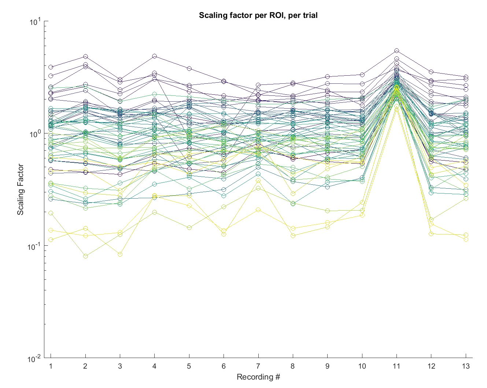
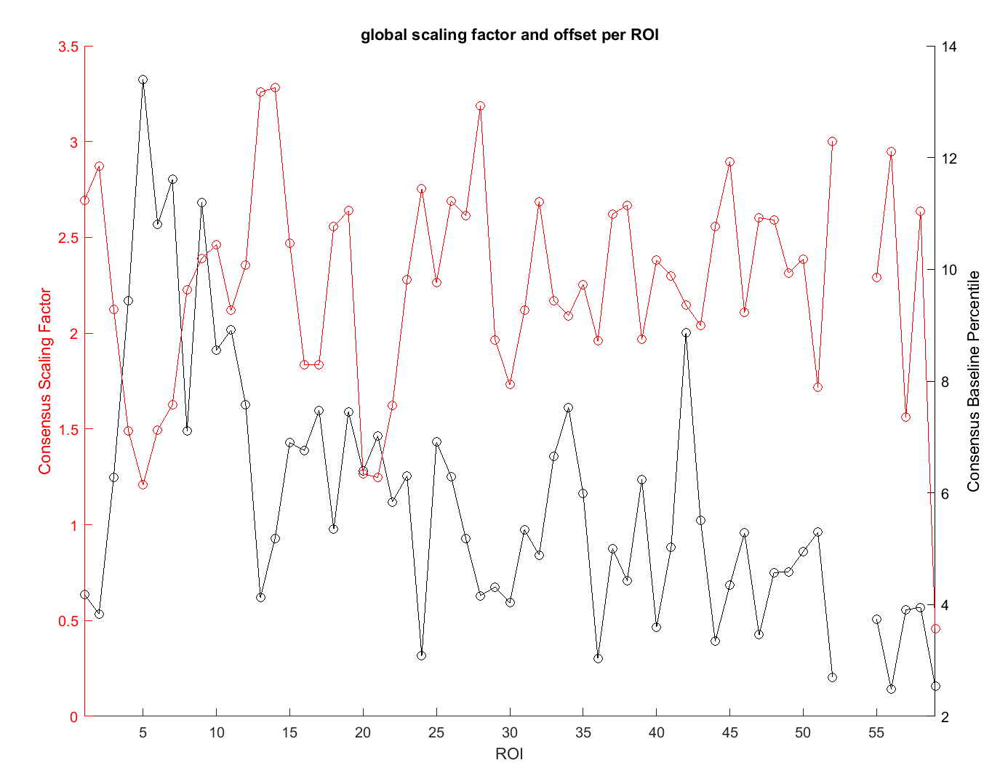
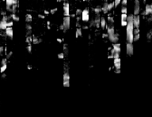
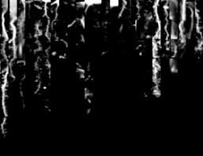
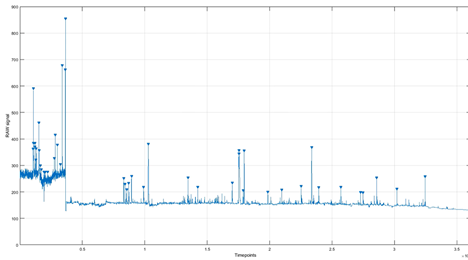
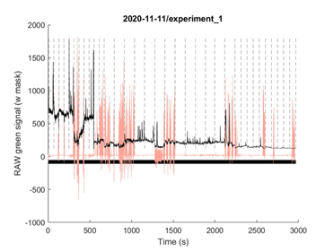
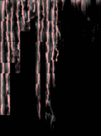
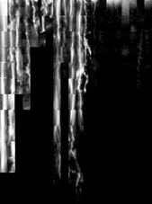

[toc]


# Arboreal Scanning Curation & Analysis Pipeline Overview

## Multiple levels of analysis

To analyse signals from a single recording, the easy way is to use the `load_experiment()` function from the *microscope controller.* This generic function enable the extraction of signals from various type of data (point scan, line scan , patches, arboreal scanning , population imaging or volume imaging for example), and implement various normalization, smoothing and masking options. 

However, for arboreal scanning experiment, if you wish to integrate the 3D spatial structure in the analysis process, signals need to be linked to their 3D location on the dendritic tree. This can be handled using an `arboreal_scan` object (see [here](#Analyse-a-recording-(arboreal_scan-objects))), which is essentially a MATLAB object containing:

- The extracted signal (as provided by `load_experiment()`)
- The tree structure and additional morphometric information (e.g. soma location, depth etc...)
- Aligned behavioural variables (e.g. camera, encoder etc...)

arboreal_scan objects are included in the main code of the microscope_controller. However, analysis procedures, and tools enabling the analysis of/across multiple recordings, or of/across multiple neurons are included in this toolbox.

For example, If you wish to compare data across multiple successive recordings, the data from multiple (matching) `arboreal_scan`objects can be stored in an `arboreal_scan_experiment` object (see [here](Analyse-an-experiment-(arboreal_scan_experiment-objects))). This will help analyse data cross multiple behavioural conditions. If you need to pool multiple recordings, it will be essential to guarantee that all ROIs are matching each other from the beginning to the end of the experiments (i.e. same mask, no drift etc....). This requires a thorough curation of your data, as explained in the [Data Curation](#Curation) chapter

Finally, to perform group data analysis across experiments, `arboreal_scan_experiment` objects can be regrouped in an `arboreal_scan_dataset` object


## Demo Scripts

In order to better understand the abilities of this toolbox, a number of demo scripts covering multiple aspects of the analysis are provided. 

[SECTION IN PROGRESS - ADD ONE EXAMPLE PER CHAPTER]

You will find demo script for

* Curating your dataset

​	`Demo_curation.mlx` will walk you through the key curation steps for an entire dataset. See additional comments in the in the [Curation](#Curation) chapter

* Displaying results as matrices or on the tree structure


* Relating Imaging signal with behavioural metrics


* Exploring the dataset (smoothing, Normalization, display of common metrics)

​		`Demo_analysis.mlx` will walk you through the most common analysis methods

* Cross correlation


* Dimensionality reduction


* Clustering


* Machine Learning


## Curation

### Global Curation Flow chart

1 - Deletion of failed recordings (lost MC etc…)

2 - Identification of « homogeneous experiments » (same resolution and same ROIs)

3 - Global registration

4 - Global mask computed on registered data

5 - Extraction of RAW Ca2+ (or normalized signals, this is up to you), using global registration and mask

6 - Compression of each ROI into either a single pixel time series (i.e. LowD projection. This is much faster for analysis) OR an array of values (projection along the dendritic shaft, i.e. HD projection) . This is a 2-step or 1-step process:

6a - Max across the dendrite (mean would work, median would be bad)

6b - Median along the dendrite (Mean would work, max would work. Median removes most artifacts, max emphasize hotspots (and artifacts). Mean is usually close to median). Note that you cou

7 - Data goes into an « arboreal_scan » object that also contains information about the tree morphology. Extraction information (e.g. header, masks, and other info) and behavioural data (e.g. encoder, MC log and Video motion indices) are stored too.

8 - Recordings are concatenated

9 - Some analyses require amplitude-normalized data. For each ROI, we find a unique offset and scalar that scales all the reponse amplitudes to the cell median trace (ref_trace). Several normalization options are possible:

9a - For the offset -> computed on baseline

\- Option 1 : Constant percentile subtraction (not used, 10th percentile would do)

\- Option 2 : Custom optimisation that prevents over subtraction (used)

9b - For the scalar -> computed on peaks

\- Option 1 : Simple linear regression between ROI_trace and ref_trace

\- Option 2 : Custom optimisation function (used)

 

### General process after data acquisition

Store/backup data and create top folder for analysis. Cleanup unwanted data & build lab-book and settings file. Fix tree morphologies and extract Ca2+ per ROI. Extract/analysis features from Ca2+ signals (e.g. events) and do meta-analysis on extracted features, per cell/experiment.

For a script going through the different steps, see `Curation_Helper.m`

**1.**    **Select and organize folders**

<u>1.1.   Backup your data</u>

Put a copy of all experiments relevant to the study in the same folder. This folder will be called `“TOP_FOLDER”` in the following examples. THIS SHOULD BE A **COPY** OF YOUR ORIGINAL DATA. because the curation process will include the deletion of some recordings.

In the following examples, the folder used for analysis, and containing all the raw data is called

``` matlab
TOP_FOLDER = "D:/Curated Data/";
```

<u>1.2.  Clean-up unnecessary files</u>

Remove any empty *folder/subfolder* and processed files (concatenated, averaged etc…). Use the dedicated function for that (safer and faster): 

```matlab
cleanup_processed_data(TOP_FOLDER)
```

<u>1.3.  Fix timestamp issues</u>

Experiment order is extracted from the folder timestamp, which is in the *hh-mm-ss* format. If you had experiments spanning over midnight, you need to manually merge those by changing the date of the recordings (i.e. the *data_folder*) past midnight back to when the experiment started. 

>  Note : This will be improved in a future release, but for now, you need to handle it manually 

You need to add 24 to the hour value for each *data_folder* beyond midnight, and then move these recordings to the correct/original *expe_folder*. For example you started your experiment in *…/01-01-2020/experiment_3/* and then your recording data_folders are *[*…*]; 23-55-00 ; 23-59-00.* Then the next recording passed midnight, which will create a new *day_folder* and *expe_folder* folder as *…/02-01-2020/experiment_1/* where *data_folder* names are now (for example) *00-00-01 ; 00-05-00* etc… . Select those, rename them to *24-00-01 ; 24-05-00* etc… and move them to …*/01-01-2020/experiment_3/*. Don’t forget to update the log: timestamp tags and content.

 **2.**    **Create a lab-book**

As it can be hard to see the big picture with many recordings, you can automatically generate a xlsx file from all recordings.

<u>2.1.  Create a log from your raw data</u>

Create a .xlsx log file using available files. See [Lab Book section](#Lab-Book) in the manual. This will create an xlsx table with some key information using the header and some other information available in the data_folders.

```matlab
SPREADSHEET_NAME = create_spreadsheet(TOP_FOLDER, '.xlsx')
```

> Note : If you update an existing spreadsheet, see `update_spreadsheet()` documentation

<u>2.2.     Complete the header info</u>

You can (and should) fill it with header info, which can be done using `fill_specific_spreadsheet_column(TOP_FOLDER, SPREADSHEET_NAME)`. This will go through every recording, load the header, extract some info and add it to the table.

 **3.**    **Identify good experiments. Delete the rest**

<u>3.1.  Manual curation</u>

Using the pre-filled lab-book, you can identify experiments that can be deleted easily (e.g. short “test” recordings, funny dwell times or patch size). It is recommended to go manually through every folder. However you can detect specific conditions automatically. For example, to identify all the recordings that are <1 second :

```matlab
data_folders = find_specific_condition(TOP_FOLDER, {'duration','<1', 'mode','Ribbon'})'  
```

You could automatically delete those, but it is recommended to manually check each case. 

>  Don’t delete the initial skeleton!

<u>3.2.  Customized problem detection</u>

Use specific functions to identify problematic recordings:

```matlab
batch_detect_mc_issues(TOP_FOLDER) ;` % for failed MC issues
```

#### **4.**    **Create *settings* file for batch analysis**

For later batch analysis (i.e. going through multiple recordings or across multiple experiments), only experiments listed in the file *settings.txt* will be used. You need to list here all experiments to be analysed. This file contains summarized information about the tree morphology for each experiment, one line per experiment. Each entry per line is separated by vertical bars (|). Lines starting with # are ignored. See how to build your [Batch Settings File](#Batch-settings-file) chapter. 

<u>4.1.  Auto-Generate settings.txt</u>

You can automatically generate the file using specific columns from your spreadsheet to get the required information. 

> This means you need to complete your spreadsheet first, by going through each neuron and checking/fixing tree morphologies. See the [fix tree morphology](#) section to know how to do that

 

The fields required in the settings.txt file are: 

1 - experiment path

2 - array of trials to use (0 or [] for all)

3 - branches that connect to soma. If NaN, branch 1 is used as a start point; If [], the branch selector is opened interactively

4 - manual reconnections; [] or NaN to ignore

5 - branch to exclude; [] or NaN to ignore

6 - pia position OR pia position and soma manual Z location. Soma location is useful if you didn’t trace an entire tree (maybe the soma is too deep) and need to estimate where the tree starts.

​       If soma is NaN or not specified, value is obtained from the start point of branch 1.

​       If pia is [] or NaN, surface is set as the highest Z value of the tree.

You need to specify these values if you plan to use tree morphology. There’s a GUI called ROI_Filter available to help you identify soma connected, manual reconnected, and excluded branches. You can call it directly from the microscope_controller or use the core functions in command line. See “Fixing tree using the toolbox” in the manual. Although you can create the settings.txt file manually, I recommend to put the values in some columns in your lab book and then generate a settings file automatically using `get_setting_file_from_table`

***ADD note on script handles

 

4.2.  Once the spreadsheet is updated, you can generate the batch setting file using `get_setting_file_from_table(SPREADSHEET_NAME, TOP_FOLDER);` 

4.3.  You should verify the settings.txt file is correct and properly formatted. Then, move the file to the TOP_FOLDER location, as this is where most of the auto-processing scripts look will for it later on.

 

**5.**    **Generate Tree projection figures**. This is to check that you have a good representation of the tree shape and soma location. This code assumes that your tree is properly reconnected (see previous step)

5.1.  Use this batch function to generate all the tree thumbnails

`batch_generate_lateral_projection(TOP_FOLDER,SETTINGS_FILE)`.

Once done, check all images and come back to the trees with incorrect morphology, fix the spreadsheet info, regenerate the settings file, and rerun the script for the problematic experiments (or for all experiments).


> NOTE : Steps 6,7,8,9 and 10 can be done at once using `batch_global_preprocessing(TOP_FOLDER, true, true, true, true, {'Ribbon',1})`, or to go faster and skip local registration, `batch_global_preprocessing(TOP_FOLDER, false, true, true, true,{'Ribbon',1})`


**6.**    **(Optional) Quickly Generate thumbnails** 

If you want to do a visual inspection of your data first, before diving into the time consuming steps that follow, consider using `batch_generate_experiment_thumbnails(TOP_FOLDER, channel)`. Note that this step requires Imagej and Miji. Look for information about setting up Miji in the documentation (you have a couple .jar files to copy when you first set it up). This step is included in the `batch_generate_consensus_dendritic_mask` function but running it standalone, without MC, is faster and will help identify bad recordings (e.g. lost MC, off-centred cells etc.). 


**7.**    **Generate Global registration.** This is a very long and tedious step. It should be done after deleting problematic recordings AND should be regenerated if you delete some recordings. However, having preregistered posthoc MC will speed up later batch analysis. In each data_folder, a file called auto_offsets.mat is generated.

If you want to generate at the same time registration values, thumbnails, and masks, you can call:

`batch_generate_consensus_dendritic_mask(TOP_FOLDER, true, true, true, true, {'Ribbon',1})`

This will process all Ribbon scans of same resolution. The function will choose the largest group (i.e. if the majority of the cell-wide recordings were LD, then {'Ribbon',1} will auto-detect these). For the second largest group, you would pick {'Ribbon',2}. If you have partial scans of the tree, the largest homogeneous group of partial scans can be selected with {'Ribbon',’partial’,1} etc…

Warning: This is an extremely long process. This should be done on a powerful PC with a lot or RAM (e.g. 20-core, 32-64GB RAM). It may take 1 hr or more per experiment! 

 

**8.**    **Generate Global Thumbnails.** Thumbnails are convenient to browse data and know what the general content for a given recording is. They are essentially a “time projection” of the ribbon scan. The projection can be done with the curtain view (more useful, as it enables viewing all ROIs at their real resolution) or a realistic view (which can be useful to have an image of the cell's true shape). Several projection methods are available, although std, corr and max give the best results. Ideally, the projection should use the posthoc registered data for better sharpness. The typical pipeline generates individual masks, for each recording, but also a consensus_thumbnail using all similar recordings in a given experiment. Ideally, the global masks computed in the next step will use the global_thumbnail rather than the thumbnail of individual recordings.

To only generate / regenerate thumbnails for an experiment, use ….

This process can be integrated in the `batch_generate_consensus_dendritic_mask function`. The generation of the thumbnail is controlled by the 4th input of

`batch_generate_consensus_dendritic_mask(TOP_FOLDER, true, true, true, true, {'Ribbon',1})`

 

**9.**    **Generate Global masks.** Masks are useful to filter out non-dendritic signals (for example, other neurons). As for global registration, this step can be pretty long to do, however you can do the processing once, and reload them later on. Global masks are not done on a data_folder-by-data folder basis, but we use a concatenation of all your recordings to find the best mask. If you already computed the consensus_thumbnail and want to generate/regenerate masks, you can use:

`batch_show_cell_mask('D:\Curated Data\', 'thin_mask');`

You could actually compute the mask on any image, including an image you would have pre-processed externally, providing the resolution matches the recording. This could be useful when only one recording enables the identification of dendrite position (e.g. very little activity across the experiment), while the global mask or the other recordings were too dim. The mask computed on the optimal recording could then be propagated to the other data_folders. Using a single mask for all recordings is only reasonable if :

\-     Your sample is perfectly still across recordings.

\-     You computed global registration, and always reload registered data using the global registration values

TRY TO GET RID OF THE BIOINFORMATIC TOOLBOX REQUIREMENT FOR MASKS

 

**10.**  **Generate Mean Calcium trace.** Before loading the data for analysis, you may want to check for additional issues (e.g. bleaching, poor MC etc…). You can generate a time series using the first branch of your neuron across recordings of similar shape (see `find_homognenous_cases`). You can also superimpose the encoder, behavioral task epoch (listed in the lab book), and trigger location. 

`[table, ~] = read_xlsx_columns(‘xlsx log path.xlsx','','A','L',1);`

`batch_generate_experiment_mean_trace('D:\Curated Data\',2, 1, true, table)`


**11.**  **Additional controls**

Once all of these extraction steps are complete, there are a few additional control functions that:

\-     Test if all files were extracted

`test_global_processing_files(expe_folder, settings_file_path)`

\-     Test the amount of posthoc MC (this will show if there was some drift)

`test_global_processing(expe_folder, settings_file_path)`

 

**12.**  Check the extraction for undetected issues. You can generate a power point with one slide per cell to screen the dataset. 

12.1.  The PPT generator will look for specific images from the previous steps. This includes:

\-     Global thumbnail + mask in curtain view. If not available, just the global thumbnail. See “Generate Global masks”

\-     Global thumbnail in realistic mode. See “Generate Global Thumbnails”

\-     3 tree figures : Distance tree from soma, fixed tree (excluded branches, direct soma connections etc…), tree + population. See “Generate Tree projection figures”

\-     Stack Z, X and Y projection with the tree shape and the interpolated soma location overlaid. See “Generate Tree projection figures”

\-     The mean calcium trace for the trial. If available, you can add markers for triggers and experiment type. See...


**13.**  **Extract calcium transients and generate \*arboreal_scan\* objects.** Values per ROI for each data_folder are extracted and stored in an *arboreal_scan* object that can be used later to plot some results (see section XXX) or for meta analysis. This is a tree-simplification step. If you change the way your signal is extracted from a given ROI (e.g. different masks, different registration or averaging method), you will have to regenerate the *arboreal_scan* object. For each recording, an *arboreal_scan*.mat object is created. 

13.1.  Arboreal scan object

If you want to use the default extraction settings for a given data folder (channel 2, no filtering, non-partial etc… see *extract_arboreal_scan.m* default values), you can type directly: 

`extract_arboreal_scan(‘Some/data/folder’)`

13.2.  Extract all *arboreal_scan* objects for one or several experiments

You most likely don’t want to analyse just a single data_folder but recordings from one or several experiments. You can use batch processing functions for that. For a single experiment, use `batch_extract_arboreal_scan('Some/expe/folder')`

For multiple experiments, use `meta_batch_extract_arboreal_scan({'Some/expe/folder/ , Another/expe/folder/'})`

OR

`meta_batch_extract_arboreal_scan('Top/Folder')`

13.3.  Input control

If the settings file is not in your top folder, you need to specify it or your tree morphologies will be incorrect. 

`meta_batch_extract_arboreal_scan('Top/Folder/', ‘Path/to/settings.txt)`

You can also specify an export path (default is pwd) and a non-default set of analysis parameters (eg. to extract another channel or use another mask file etc…). Default extraction values are detailed in *extract_arboreal_scan*. If you wanted to change something, you could pass pairs of {argument, value} in the 2nd input. By default, ‘auto_mask’ and ‘auto_registration’ are used.  

`expe = arboreal_scan_experiment(‘arboreal_scan/extracted/path')`;

>>>>>>> a9f8446c758c2d0bf41dd0614bcad9572f750b54


**14.**  **Generate \*arboreal_scan_experiment\* objects.** the *arboreal_scan_experiment* object enables computing features across recordings (e.g. event detection, cross-correlation, factor analysis etc…). and plotting figures per neuron. 

14.1.  To create an *arboreal_scan_experiment* object for single experiment:

`expe = arboreal_scan_experiment(‘arboreal_scan/extracted/path');`

 To fill the fields automatically (using default binning by steps of 100um), use 

`expe.process();`

However, you may want to set the correct binning method (see `arboreal_scan.get_ROI_groups())`.

This processing pipeline loads multiple recordings and rescales traces with each other. It then detects and extract bAPs, performs multiple operations on event correlation, distribution etc… Dimensionality analysis is done too. Figures can be saved in the export folder using `expe.save()` for the meta_analysis step. 

14.2.  *Arboreal_scan_experiment* objects for multiple experiments:

Use a loop:

```matlab
top_export_folder 	= '…/extracted_arboreal_scans/';
fold 				= dir([top_export_folder,'/*-*-*_exp_*']);
fold 				= fold([fold.isdir]);
for idx = 1:numel(fold)
    expe 			= arboreal_scan_experiment([fold(idx).folder,'/',fold(idx).name]);
    expe.rendering 	= true; % set to false if you don't want to see the all figures
    % at this stage, you can adjust also the smoothing and detrending
    expe.process(); 		% adjust binning options here
    expe.save(true); 		% save the object afeter processign (or not)
	close all
end
```

There's a demo script that can extract_all the experiment and save them (run it overnight for example, so the next day the reloading will be faster)

see `extract_all_expe.m`

**15.**  **Meta analysis**. You can later reuse the extracted features from each tree to build figures. To analyse individual trees after the meta analysis extraction step, reload summary.mat. Then use `results.plot_dim_tree(neuron_id, 1)`. 

To do some meta analysis across all the trees:

`results.plot_gallery ('dim')` % can use ‘dim’, ‘dist’, or ‘corr’


**16.**  You can select a range of trees or change the projection dimension.


# Analyse a recording (arboreal_scan objects)

TODO

This will be the doc for the Arboreal_Scan objects


## Build the arboreal_scan object

```matlab
data_folder = 'D:\Curated Data\2019-10-03\experiment_5\20-36-43' 

%% Create the arboreal_scan object for data folder
a_s = arboreal_scan(data_folder);

%% Prepare tree information. 
% Option 1, settings.txt is in the TOP_FOLDER
a_s.prepare_tree();
% Prepare tree information. Option 2, provide the path to settings.txt
a_s.prepare_tree('path/to/settings.txt');
% Prepare tree information. Option 2, provide the batch_params structure
a_s.prepare_tree(batch_params);

%% Prepare the extraction (concatenation etc...). This uses default values (if you type a_s.prepare_extraction() the default values are printed in an error message)
a_s.prepare_extraction(data_folder);

%% Save
a_s.save();
```


##  Basic Use

```matlab
%% Plot ROIs (for advanced use of this method, see dedicated doc)
a_s.plot_value_tree

%% Plot soma population 
a_s.plot_population();

%% Plot the distance from soma (use to check that branches are well reconnected)
a_s.plot_dist_tree

%% Example to plot both the tree and the population
a_s.plot_dist_tree(); hold on;a_s.plot_population();
```


## Different types of tree

ALSO BELONGS TO MAIN DOC

Different trees are generated throughout the acquisition / analysis process. Unless indicated, all these trees use the original Z-stack coordinates (i.e. stack X-Y pixels size and plane spacing for Z- pixel size). They can all be converted to microns using information from the acquisition header. See `rescale_tree() `for the rescaling formula.

### Files

- The original *.swc* file, which is present at the experiment_folder level with its original name. This is the file you traced in Vaa3D initially.

- The original *.marker* file (if you did population imaging). Same as above.

- If you acquired both the tree and the population, the two files are merged into a file named *hybrid_scan.swc*, where the markers are stacked at the end of the file. This file can be found both at the *experiment_folder* level and sometimes at the *data_folder* level. This file is only found at the *data_folder* level if you did a "hybrid" scan (i.e. pop + markers).

- *simplified_neuron.swc*, in the data_folder : a *swc file approximating the computed microscope drives, depending on your segmentation settings. The lines correspond to the central line of each ROI (the skeleton). If you did a Ribbon scan or volumetric imaging, this will still only show one line per patch, and you'll have to rebuild the rest of the drives using the header data and some dedicated methods  [LINK HERE].

- A copy of the original file used for tracing : *structure_reference.bkp*, within the *data_folder*.

  > *simplified_neuron.swc* correspond only to what was really scanned (so, a subset of the scan for partial scans), while the other files contain the entire tree on which the scan is based on.

### Header fields

The header contains additional (or duplicated) fields. Tree coordinates are stored in Trees objects, although the matrix corresponding to the .swc file can always be obtained in the `trees{1}.table` field.

- `header.structure_reference` contains the path of the original file that was used for the segmentation, at the time of acquisition. The folder may have been deleted, however the corresponding .swc file remains available in each data_folder

- `header.partial` will indicate if the entire tree was scanned or just a subset of ROIs. If this is the case, `header.ROIs` or `header.branch_ids` (depending on your selection filter during acquisition) will indicate what was selected. 

- `header.trees` is a Trees object containing 

  - `header.trees{1}` : the tree that was actually acquired. This corresponds to the *simplified_neuron.swc* file, and will match `header.start_pixels` and `header.stop_pixels`
  - `trees{2:end}` : All simplified branches of the tree, including the ones that were not imaged. You can always rebuild the full simplified tree using `reconsituted_tree = pool_tree(header.trees)`.

- `header.original_trees` is a Trees object  containing 

  - `header.original_trees{1}` : The full source neuron,, even in partial scan mode. This corresponds to the the .bkp file
  - `original_trees{2:end}` : All simplified branches of the tree, including the ones that were not imaged. You can always rebuild the full simplified tree using `reconsituted_tree = pool_tree(header.trees)`.

- For each ROI (in `header.ROIs`)

  - `header.res_list` : the x-y-z resolution of the ROIs

  - `header.start_pixels` and `header.stop_pixels` : the start and stop location of each line scan, one cell per ROI. The number of lines matches `header.res_list(:,2);`

    > IMPORTANT  NOTE : `header.start_pixels` and `header.stop_pixels` are expressed in cubic voxels. To match them against the original swc tree, you need to scale the Z axis by `header.xy_to_z_scaling`. Additionally, because of some strange Vaa3d flipping issues, X and Y are flipped and the Y axis is mirrored (that is due to a tick box in Vaa3d options) ....

- `header.offset` is an additional offset applied to the entire coordinate system, used to compensate for drifts from te original tracing

  Note that the drives are expressed 

```matlab
%% Match the files, the header tree and the microscope drives
h = load_header('some/data/folder')

x_sta = cell2mat(cellfun(@(x) x(1,:), h.start_pixels, 'Uni', false));
y_sta = cell2mat(cellfun(@(x) x(2,:), h.start_pixels, 'Uni', false));
z_sta = cell2mat(cellfun(@(x) x(3,:), h.start_pixels, 'Uni', false));
x_sto = cell2mat(cellfun(@(x) x(1,:), h.stop_pixels, 'Uni', false));
y_sto = cell2mat(cellfun(@(x) x(2,:), h.stop_pixels, 'Uni', false));
z_sto = cell2mat(cellfun(@(x) x(3,:), h.stop_pixels, 'Uni', false));

%% Case 1 ; for a full scan (non-partial)
% Plot the start-stop pixels (after reonversion back into the original swc format, see note above)
figure();plot3([y_sta;y_sto],512-[x_sta;x_sto],[z_sta;z_sto]/h.xy_to_z_scaling,'k'); hold on;
%% Add simplified neuron tree
plot_tree(h.trees{1},'r'); hold on
%% Add original tree
plot_tree(h.original_trees{1},'b'); hold on

%% Case 2 : for a partial scan
h2 = load_header('some/data/folder')

x_sta = cell2mat(cellfun(@(x) x(1,:), h.start_pixels, 'Uni', false));
y_sta = cell2mat(cellfun(@(x) x(2,:), h.start_pixels, 'Uni', false));
z_sta = cell2mat(cellfun(@(x) x(3,:), h.start_pixels, 'Uni', false));
x_sto = cell2mat(cellfun(@(x) x(1,:), h.stop_pixels, 'Uni', false));
y_sto = cell2mat(cellfun(@(x) x(2,:), h.stop_pixels, 'Uni', false));
z_sto = cell2mat(cellfun(@(x) x(3,:), h.stop_pixels, 'Uni', false));

% Plot the start-stop pixels (after reconversion back into the original swc format, see note above)
figure();plot3([y_sta;y_sto],512-[x_sta;x_sto],[z_sta;z_sto]/h2.xy_to_z_scaling,'k'); hold on;
%% Add simplified neuron tree
plot_tree(h2.trees{1},'r'); hold on
%% Add original tree
plot_tree(h2.original_trees{1},'b'); hold on
```

### arboreal_scan properties

The arboreal_scan objects contains, on top of the header information (which can be accessed in `a_s.header`), morphological information about the tree. This includes : proper tree scaling (in microns from the pia), the exclusion of rejected branches, and information about how the branches connect to each other.

- `a_s.original_trees{1}` correspond to the rescaled (in microns) and offset (as a distance from the surface) version of the original .swc file. Branches were reconnected according to the batch_params
- `a_s.original_trees_filtered{1}` correspond to the rescaled (in microns) and offset (as a distance from the surface) version of the original .swc file, minus the branches that were excluded
- `a_s.original_pop{1}` correspond to the rescaled (in microns) and offset (as a distance from the surface) version of the original .marker file
- `a_s.simplified_tree{1}` correspond to the rescaled (in microns) and offset (as a distance from the surface) version of *simplified_neuron.swc* file, which is what you actually scanned. Branches were reconnected according to the batch_params
- `a_s.simplified_tree_filtered{1}`. Same as above, minus excluded branches
- `a_s.simplified_skeleton` is a version of `a_s.simplified_tree` where very ROI is treated as a separated, independent branch, with it own tart and stop value. This can be more convenient for some analysis, as the ROI segment is located at known point `[(N x 2) -1, N x 2]`

```matlab
%% Starting from an arboreal_scan object a_s (trace extraction not needed):

figure();
%% Add original, unscaled tree (in cubic voxels)
plot_tree(a_s.header.trees{1},'g'); hold on

%% Add original tree, scaled, fixed and offset
plot_tree(a_s.original_tree{1}, 'r'); hold on

%% Add original tree, scaled, fixed and offset, minus excluded branches
plot_tree(a_s.original_tree_filtered{1}, 'k'); hold on

%% Add original population, scaled and offset
plot_curved_tree(a_s.original_pop{1}); hold on

%% Add simplified tree, scaled, fixed and offset
plot_tree(a_s.simplified_tree{1}, 'm'); hold on

%% Add simplified tree,, scaled, fixed and offset, minus excluded branches
plot_tree(a_s.simplified_tree_filtered{1}, 'b'); hold on
```


## Extract and save arboreal_scan objects for an entire experiment

To extract all data_folders of an experiment that share the same imaging configuration, simply use 

```matlab
%% Export arboreal_scans
source_folder = 'path/to/expe_folder_or_higher_level'
export_folder = 'some/folder/to/extract/individual/arboreal_scans'
meta_batch_extract_arboreal_scan(source_folder','','',export_folder)

%% Optionally, you may have to indicate the settings.txt file, and you can modulate the default extraction options
-TO DOCUMENT

%% Later, you can create an arboreal_scan_experiment object using this export folder
obj = arboreal_scan_experiment([export_folder,'extracted_arboreal_scans\yyyy-mm-dd_exp_N']);
```


## Build arboreal_scan_experiments objects for all recordings

Once the `arboreal_scan` objects are extracted, you can build `arboreal_scan experiment` objects. Basically, all you need is a for-loop.

```matlab
export_folder = 'some/folder/to/extract/individual/arboreal_scans';
fold = dir([top_export_folder,'/*-*-*_exp_*']);
fold = fold([fold.isdir]);
for idx = 1:numel(fold)
    expe = arboreal_scan_experiment([fold(idx).folder,'/',fold(idx).name]);
    expe.process(); %% Add grouping settings here, for exampl {'depth',50}
    expe.save(true);
    close all
end
```


# Analyse an experiment (arboreal_scan_experiment objects)

Load an `arboreal_scan_experiment` object, that you have previously generated. This object regroups multiple `arboreal_scan` objects that shared the same tree structure (i.e., it's the exact same set of branches and ROIs, not a subset or a different tracing of the same neuron) . The loaded object handle is called "obj" by default, although you can rename it.


## Processing pipeline

Essentially, the recommended analysis process consist in :

- Building the object : Load all the relevant arboreal_scan objects that come from the same cell into an `arboreal_scan_experiment`.
- Normalized data : Rescaling traces so you can compare dim and bright regions more easily.
- Event detection : Identify Global/Local events using pairwise correlation across the tree, or a threshold on the averaged traces.
- Filter data : Flag problematic/low quality/wrongly selected ROIs so they will be ignored in following analyses.
- Regroup traces into "bins", i.e. regions that will be processed together (e.g. basolateral vs apical, or bins at some set distance from the soma)
- Process data by bin or by ROI. Among these processing options you can
  - Analyse correlation or similarities between regions
  - Extract events
  - Do some dimensionality reduction analysis on each region or ROI
  - Correlate against behaviours

> Note: The entire pipeline can be run
>
> * In command line step by step (see below)
> * Automatically using `obj.process()` (see )
> * step by step using a GUI

#### Loading/object building 

This function is typically controlled by the constructor, although you can update the object later if you changed the list of recordings, or if you changed the extraction method (e.g. new post-hoc MC, different mask...).

```matlab
%% Case 1
%% To build the object from extracted arboreal_scans (recommended)
obj = arboreal_scan_experiment(source_folder); % where source_folder is a folder containing multiple extracted arboreal_scans 												   % objects (files can be in subfolders) 

%% To build the object from extracted arboreal_scans and keep XxT data for each ROI (this will use much more memory)
obj = arboreal_scan_experiment(source_folder, true); % 

%% Case 2
	%% To build the object from data_folders
obj = arboreal_scan_experiment(source_folder); % In the absence of extracted arboreal_scan, The code will ask you if you want to process the data directly. Note that as for regular arboreal_scan extraction, the folder must follow the standard day/expe/data_folder structure, and there must be a settings.txt file indicating how to reconnect the tree. see arboreal_scan documentation for details

	%% To build the object from data_folders using specific analysis_params
obj = arboreal_scan_experiment(source_folder, '', analysis_params('smoothing', 20));

	%% To build the object from data_folders using a custom settings.txt file
obj = arboreal_scan_experiment(source_folder, '', '', 'path/to/settings.txt'');

%% Case 3
%% To update the object with the same compression settings, if you added/removed arboreals scans, or if you changed something in the arboreal scan content (e.g. you added some external behavioural variables)
obj.update(); % Note that since this will affect the binned traces, all analysis need to be regenerated. All analysis fields will be cleared

%% To update the object with XxT data, because you didn't include it initially
obj.update(true, true);
```

If you moved the original data, or the extracted arboreal_scans objects (depending on what you used for extraction), there are a few operations that won't work anymore : 

- re-extract data
- Update the compression method
- reload the original signal from the analyzed trees

If the data was just moved to a different folder or hard drive, you can set the new location in `obj.update_folder`.


#### Automated analysis using `obj.process()`

```matlab
%% Process the entire tree at once
obj.process();

%% Process using one of the supported binning method
obj.process({'depth',100}); % by depth, using bins of 100 um

%% Process without generating figures
obj.rendering = false;
obj.process(...);
```

### GUI

```matlab
%% Start the GUI, then click on the options....
obj.gui();
```

#### Save the result

```matlab
%% To save the object
obj.save()

%% If you want to auto-save results, you can do the following
obj.auto_save_analysis = true;
obj.process(...);

%% To save the figures
obj.save_figures();

%% or, to auto-save the figures, you can do the following
obj.auto_save_figures = true;
obj.process(...);
```

## Object structure

```matlab
            source_folder: 'C:\Users\vanto\Documents\MATLAB\RIBBON_SCAN_PAPER'
     extracted_data_paths: {1×3 cell}
           arboreal_scans: {[1×1 arboreal_scan]  [1×1 arboreal_scan]  [1×1 arboreal_scan]}
                      ref: [1×1 arboreal_scan]
                timescale: [1×1 struct]
        global_median_raw: [1485×1 single]
     global_median_scaled: []
                        t: [1×1485 double]
             batch_params: [1×1 struct]
              need_update: [1 1 1]
        extraction_method: 'median'
         extracted_traces: {[495×107 single]  [495×107 single]  [495×107 single]}
    extracted_traces_conc: [1485×107 single]
                   n_ROIs: 107
                     demo: 0
           time_smoothing: [5 0]
              filter_type: 'gaussian'
                 peak_thr: 2
                  cc_mode: 'peaks'
          rescaled_traces: [1485×107 single]
                  detrend: 1
           rescaling_info: [1×1 struct]
              binned_data: [1×1 struct]
                    event: [1×1 struct]
            event_fitting: [1×1 struct]
              variability: [1×1 struct]
                crosscorr: 1
           dimensionality: [1×1 struct]
       external_variables: {[1×1 struct]  [1×1 struct]  [1×1 struct]}
              spiketrains: []
               behaviours: [1×1 struct]
           default_handle: @(x)load_several_experiments(x,cellfun(@(x)x.data_folder,obj.arboreal_scans,'UniformOutput',false),use_mask)
             bad_ROI_list: [1 2 3 4 5 20 27 28 31 32 33 34 47 50 72 106 107]
                rendering: 1
```

## Some general properties

`obj.source_folder` indicates where these individual arboreal_scans recordings were located, and `extracted_data_paths` point at the exact file used for loading these data.

`obj.arboreal_scans` is a cells array containing the individual arboreal_scans you extracted, i.e. an object containing information about the tree structure, the experiment (header, behavioural data) and the extracted calcium signals, using specific masks and registration options. 

> Note : if you were to change the registration method or the masks, you will have to re-extract the calcium signals, and therefore regenerate the arboreal_scans objects and any object/analysis that depend on it (e.g.  the arboreal_scan_experiment object). The extraction options initially used can be obtained in `obj.arboreal_scans{1}.analysis_params`. The mask used can be seen in `obj.arboreal_scans{1}.mask`

> Note : obj.arboreal_scans{N}  DOES NOT contain as much data than the source arboreal_scan object indicated (i.e. one value per voxel along along a ROI), but ONLY one trace per ROI. This value is obtained through a specific compression mechanism. For more details about the compression mechanism, see the [corresponding section](#....). 

`obj.ref` points at the first arboreal_scan, to simplify function calls. This assume that all your arboreal_scans are identical

`obj.timescale` return, for each recording 

* the imaging sampling rate (`obj.timescale.sr`) ; measured if possible, estimated otherwise.
* The number of imaging timepoints `obj.timescale.tp`
* The duration (`obj.timescale.durations`) ; measured if possible, estimated otherwise.
* A timescale array for each recording, starting at 0 for each recording `obj.timescale.rec_timescale`
* A global, continuous timescale (no gaps between trials or recordings), where all records are contactenated `obj.timescale.global_timescale`
* The corresponding t_start for each one of these recordings `obj.timescale.t_start_nogap`
* *TODO: THE EXACT, REAL T START*

`obj.t` is a pointer to `obj.timescale.global_timescale`


`obj.batch_params` indicates the arboreal_scan structure info for the cells that are required to rebuild the tree correctly with the Trees toolbox (soma depth, primary branches, manual reconnections, excluded branches, pia and soma depth). This is actually a pointer from `obj.arboreal_scans{1}.batch_params`, and they were obtained at the time of the arboreal_scans extraction. See the main documentation on that topic.

`obj.need_update` .. TODO

`obj.n_ROIs` : the number of segments per tree, and therefore the number of traces

`obj.extracted_traces` : the extracted traces originating from each arboreal_scan, using the compression method defined in [XXXXXX]. This a [1 x N_records] cell array, of {T x N_ROI} cells. `obj.extracted_traces_conc` corresponds to the same traces, concatenated in time.

## Rescaling

`obj.rescaled_traces`. This is obtained from `obj.extracted_traces`, but where each ROIs were rescaled in regard to each other, so that the median amplitude of the events in each ROI is identical to the cells median. The rescaling is done by calling `obj.rescale_traces()`, which generate the `obj.rescaling_info` field. Each ROI is rescaled using a unique offset and scalar across all the recordings.

Rescaling figures 1012 (Scaling Factor per ROI, per trial) and 1013 (Global scaling factor and offset per ROI) can be obtained by calling `obj.plot_rescaling_info`






## Binning

In order to analyse signal differences across different parts of the dendritic tree, you can regroup ROIs based on multiple morphometric criteria, such as the depth, the distance from the soma etc...

Most analyses are done on a group-by-group basis, so one of the first steps after rescaling the traces is to choose the relevant binning method. To generate the groups, call `obj.prepare_binning(CONDITION)`, where the condition can be one of the preset modes defined in the `arboreal_scan.get_ROI_groups()` method, which uses `get_ROIs_subsets()`, or a custom segmentation.

To pass a preset mode, the CONDITION must be a STR 'condition', or a CELL ARRAY {'condition', metric} matching one of the following : 

* {'distance',DISTANCE_BIN_SIZE_UM}
* {'depth',DEPTH_BIN_SIZE_UM}. Note that bin values are centred around the soma, not from the pia, so that basolateral and apical dendrites are usually segregated.
* {'random', N_ROI_PER_BIN}
* 'branch' ; Each branch (as they were traced) form a group
* 'order' ; Branch order (primary, secondary etc..)

For a custom control, you can pass an array of cells, each cell will form a group and the condition will be labelled as 'custom'.

```matlab
%% Example 1 : Segment by bits of 100um from the soma
obj.prepare_binning({'depth',100})

%% Example 2 : Use customized groups
obj.prepare_binning([{1:10},{11:20},{21:30}]);

%% Example 3 : No binning (all ROIs in 1 group)
obj.prepare_binning();
```

The condition is stored in `obj.binned_data.condition`, the bin values are stored in `obj.binned_data.metrics`, the ROIs for each group are in `obj.binned_data.groups` (same order) and the legends displayed on figures are in `obj.binned_data.groups`

## Computing Median Traces

`obj.binned_data.global_median` correspond the median trace of all recordings, and somewhat constitute a signal representative of the entire tree. The  median trace is obtained by calling `median_trace = obj.set_median_traces()`. By default, this uses the median of the rescaled traces, although you can use the median of the raw traces instead (`median_trace = obj.set_median_traces(true)`).

`obj.binned_data.median_traces` correspond to the median trace PER GROUP, as defined by your binning method (see [binning doc](#Binning) for `obj.prepare_binning()`).

> Median traces an be displayed without or with gaussian smoothing

```matlab
obj.plot_median_traces; 			% basic median
obj.plot_median_traces(20); 		% median with a 20 point symetrical smoothing
obj.plot_median_traces([20, 0]);    % median with a 20 point asymetrical smoothing
```

## Event Detection

You can detect large transients, and store their time of occurrence in `obj.event`. 

This uses the `obj.find_events()`. Event detection can be using either a peak_amplitude approach [TODO : TO PUT BACK], or an approach that looks at correlated signal variations across the tree (either all of it, or a selected region such as the peri somatic area. see `idx_filter` input).

The default uses the following steps:

- Pairwise correlations between each pair of ROIs are computed, using a moving correlation window (see `corr_window` input). If no window_side is given, the size is set as the average event width (as found by the native matlab `findpeaks` function, which returns here the width at half prominence of all events that are 2x signal RMS).

- The average of all these Pairwise correlations is created, and indicate how correlated is the signal across the tree. A value of 1 indicates that an event covaried across every ROI of the tree, while a value of 0 suggest completely random variations (e.g. no activity). As some regions may be belonging to other neurons, the maximum may not reach 1. Therefore, the result is renormalized to the maximal values

  > These uncorrelated ROIs can be detected and excluded if we consider that they are uncorrelated because belonging to another cell, or are too faint to provide a usable signal. see XXXX

- All events that are at least present in 10% of the tree are selected as "events" This threshold can be modified by using the `cutoff` input. 

  - The time of each detected event is stored in `obj.event.t_corr`. Note that this is using the correlation window, and the actual time of peak may vary and is stored in `obj.event.peak_time` (see below).
  - The amplitude of the peak indicate how tree-wide is the correlation, and is stored in `obj.event.globality_index`
  - "Global" Events are arbitrarily set as events propagating in more than 50% of the tree, and are indicated in `obj.event.is_global`
  - Original "raw" amplitude of the fluorescent signal is stored in `obj.event.peak_value`
  - The lower and upper time range of each event are stored in `obj.event.t_win` (as defined by the onset from/offset to baseline, or by the end/start of another surrounding event) 

If you want to detect somatic events only, you can use `obj.find_events('soma')` which will only use the ROIs located the closest to the soma (on primary branches). If there is no soma (e.g. L5 cell, then the most proximal segments will be used instead)


ADD FIGURES


### Signal Compression

`arboreal_scan_experiments` have one trace per ROI. This means that each *"2D"* X-Y-T patch is compressed into a single *"0D"* 1-1-T signal array. The compression along the patch axis (that converts a X-Y-T patch into a *"1D"* X-1-T line) happens during the initial signal extraction, and these values are stored in individual `arboreal_scan` objects. This step can not be modified without re-extracting the arboreal_scans. The compression that converts *"1D"* X-1-T lines into *"0D"* 1-1-T array happens when first generating the arboreal_scan_experiment object, through the `obj.update_all_signals()` method (which actually call the `arboreal_scan.update_segment_signals()` method). The default approach takes the median signal, although this can be changed by passing a method parameter `obj.update_all_signals(method)`, with any method in {'min, 'max', median', 'mean'}. The current method is stored in the`obj.extraction_method` field.

> Reloading the data to change the compression method requires to point at the folder containing the `arboreal_scans`. This is done using `obj.extracted_data_paths`. If you moved you data, you'll need to update these paths

> Changing the method requires to reload all the individual `arboreal_scans`. To validate your changes, you need to save the object using `obj.save();`.

ADD IMAGE COMPRESSION


# Plot median trace


# Baseline detrending

Changes of signal intensity can occur during the course of the experiment. They can have multiple non-biological cause that you can try to mitigate. Baseline detrending will assume that the lowest value recorded in a given ROI correspond to the F0 of your sample. This value should not change over time, and we will consider that any recorded change is due to external factors (eg. bleaching or change of focus) that linearly decrease the intensity of the signal captured. baseline detrending will rectify the signal over time by applying a gain factor. Different methods are available.

To use detrending, set `obj.detrending` to a non-zero value.

## Continuous linear and polynomial fit

These is the simplest method. A polynomial fit is applied to the baseline of each ROI. The baseline value is estimated using after applying a large `movmin` filter on each ROI trace, in order to get values as close as possible to F0. `obj.detrend = 1` use a linear fit, `obj.detrend = 2` uses a quadratic fit etc... 

## breakpoints

If you specified "breakpoints" (i.e. known interruption in your recordings that cause abrupt changes of gain, using`obj.breakpoints`), the linear and  polynomial fit is done between each breakpoint independently. For example, if you have one breakpoint in the middle of the experiment and use linear detrending, a linear fit is done on the first half, and a second linear fit is done on the second half.

## Block correction per trial

Another option is to normalize each trial independently. To do this, set `obj.detrend = -1`. This is done ROI by ROI, as the gain can change differently across ROIs if it is due to bleaching or movements. To do this, F0 is estimated for each trial (per ROI), and a linear regression between the median F0 for this ROI and individual trials returns the gain factor for each trial

## Block normalization per trial

This use the same principle as above, but applies MATLAB median interquartile normalization to each trial.


# Analyse a dataset (arboreal_scan_dataset objects)


to add


# CURATION (IN PROGRESS)


 

**Fixing database / experiment / processing**

If any step in the global processing goes wrong, you’ll have to resume all the steps following that step before regenerating the meta-analysis

**1.**    **I added some files in my database**

As they have not been integrated at all in the process, we only need to add information. 

1.1.  Update spreadsheet

BASE_SPREADSHEET_NAME

SPREADSHEET_NAME = update_spreadsheet(TOP_FOLDER, BASE_SPREADSHEET_NAME);

fill_specific_spreadsheet_column(TOP_FOLDER, SPREADSHEET_NAME);

 

Note that this will update the table and squeeze new recordings if they happened in between existing recordings. A new file is created

 

**2.**    **I had a bad recording that had to be deleted.**

If a recording made it through the curation process, and you later decide to delete it (for example, MC was lost but not detected, or RT3D MC was really poor etc…). Here on the left is an example of a failed recording. The thumbnail is blurry, Checking the recording revealed that RT3D-MC was lost

 

​                                  

 

Here is a second example where the PMT gain was changed during the experiments. I recommend discarding the first part of the analysis to avoid any unpredictable analysis problems

 

\-     Delete the data folder from your curated data folder. You should write down somewhere that you deleted it.

\-     If you reached the stage where you have the global mean trace, you can use the image generated to see which recordings are problematic. To get the corresponding recordings name, 

 

conditions = {      'partial'   , false         ,...

​                  'mode'    , 'Ribbon'       ,...

​                  'duration'  , '>= 10'        };  

data_folders = find_specific_condition(EXPE_FOLDER, conditions);

[data_folders, ~]       = filter_homogeneous_cases(data_folders,'Ribbon',1);

data_folders’

\-     Delete corresponding thumbnail if any

\-     Delete entry from your lab-book. Not that a trace of this recoding will remain in you Log.txt file.

\-     You then need to regenerate the global MC template, the global thumbnails and the global mask before using the data. this can all be done at once with, although it can take > 1hr per experiment.

batch_generate_consensus_dendritic_mask(TOP_FOLDER, true, true, true, true, {'Ribbon',1})

 

 

**3.**    **I have bad posthoc MC**

 

\4.    

 

**5.**       **I have a bad mask**

Diagnostic: You need to identify the root cause of the bad mask. It could be poor tracing, but could also come from a bad thumbnail, which itself can come from a bad global registration. Here, the final branches look really dim, so nothing was traced. They are basolateral dendrites, so they are deep and dim in a first, place, but maybe we can get some better results.



Check that the mask is really the issue. The thumbnail + image can be misleading, as the mask is overlaid in red over the black and white thumbnail. A dark region may have a mask and not be visible. Check the mask first :

show_cell_mask(‘some/data/folder’, 'thin_mask.mat', true);

If there is a problem with the mask, it most likely come from the reference image. There are a few options : 

5.1.     Not use the global thumbnail (maybe a single recording is better somewhere). Here, there’s a recording that was a bit brighter, from individual recordings thumbnails. You can define it a ref for tracing instead of the global thumbnail

[data_folders] = filter_homogeneous_cases('D:\Curated Data\2019-11-05\experiment_3','Ribbon', 1);

new_imsource = "D:\Curated Data\2019-11-05\experiment_3\std_projection_2019-11-05_exp_3_12-38-47_mosaic_group_1_full_green_channel.png";

show_cell_mask(data_folders{1}, 'thin_mask.mat', true, true, new_imsource, true, true);



5.2.  Regenerate the global mask

 

 

\6.    Regenerate the thumbnail. Maybe the thumbnail was generated a long time ago, and you improved posthoc MC in between, or removed low quality recordings. In any case, you now need the regenerate the global thumbnail for this experiment. See case

 

 

 

 

**7.**    **My PowerPoint summary needs to be updated**

Once you updated thumbnails, you may want to update a specific ppt slide instead of regenerating the entire ppt

 

**8.**    **I deleted some files after extracting the transients. How to rematch the datasets**

8.1.  To delete extracted dataset that don’t exist enaymore

8.2.  To update a meta_analysise_arborea_scan object, run results.cleanup_expe(‘extracted’, Export_path) or results.cleanup_expe(‘original’, TOP_FOLDER). This will identify which data folder need to be removed, if they have been removed from the original/extracted data. 

Updated folders are indicated in results.need_update, and you have to re-run the meta_analysis process for those experiments

 

 

 

 

Arboreal_scan object

 

This contains essential information about the tree structure such as the list of ROIS, the branch filtering and reconnection rules, the original, and simplified tree etc… as well as information about the data extracted and the analysis_params used for that

ori = obj.original_tree{1};

simplified = obj.simplified_tree{1};

filtered = obj.simplified_tree_filtered{1};

skeleton = obj.simplified_skeleton{1};

cmap = lines(4);

 

figure();hold on;

a = plot_tree(ori,cmap(1,:));hold on;

plot_tree(skeleton,cmap(2,:));hold on;

plot_tree(simplified,cmap(3,:));

hold on;plot_tree(filtered,cmap(4,:));

axis equal;legend({'original','skeleton','simplified','filtered'});

 

 

 

 

 

 

 

 

 

 

**Fixing tree morphology**

After extracting all the trees for the meta analysis, you may want to double-check 

 

 

 

**Meta-analysis figure number**

**1001** : Median scaled responses per group

1002 : Event detection on median

**1003** (NO TITLE) : global distribution of event amplitudes

**1004** (NO TITLE) : distribution of event amplitudes per region

**1005** : Median Events and fitted decay

**10051-1005n** : Median Events and fitted decay for group n

**1006** : peaks values per subgroups

**1007** : cumulative sum of peaks

**1008** : CC matrix

**1009** : event per index of dispersion

**1010** : index of dispersion vs traces

 

**1011 :** index of dispersion vs amplitude

**1012** : Scaling factor per ROI

**1013** : Global scaling factor and offset per ROI

**1014** : median tau per group

**1015** : median tau 1 per event

**1016** : tau vs event amplitude

**1017** : components weight per ROI (matrix)

1018 : corr_tree

**1019** : individual median events and median fit

1020 : strongest component

10201 – 1020n : individual components

**1021** : Weighted signal average per component

**1022** : variability assessment (Similarity Plot)

**1023** : median traces - overall median

**1024** : …

**1025** : Spike inference (pr bin)

1026 : Behaviour

1027 : Behaviour activity bouts

1028 : cross validation result - training

1029 : cross validation result - testing

 

 

\---- 

10010 -> calibrate peak detection?