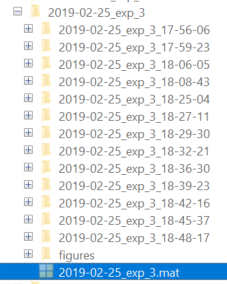

# Analyse a specific recording


# Analyse a specific extracted experiment

Load an `arboreal_scan_experiment` object, that you have previously generated. This object regroups multiple `arboreal_scan` objects that shared the same tree structure. The loaded object is called "obj" by default.

[TODO : Link to how they were generated ]




## `arboreal_scan_experiment` general structure

```matlab
       source_folder: 'C:/Users/vanto/Documents/MATLAB/extracted_arboreal_scans/2019-02-25_exp_3/'
         need_update: [1 1 1 1 1 1 1 1 1 1 1 1 1]
extracted_data_paths: {1×13 cell}
      arboreal_scans: {1×13 cell}
                 ref: [1×1 arboreal_scan]
                   t: [1×21970 double]
        batch_params: [1×1 struct]
              n_ROIs: 59
                demo: 0
          filter_win: [5 0]
         filter_type: 'gaussian'
        general_info: [1×1 struct]
            peak_thr: 2
             cc_mode: 'peaks'
    extracted_traces: {1×13 cell}
     rescaled_traces: [21970×59 single]
current_segmentation: [1×1 struct]
         binned_data: [1×1 struct]
           timescale: [1×1 struct]
               event: [1×1 struct]
       event_fitting: [1×1 struct]
         variability: [1×1 struct]
           crosscorr: [6×6 single]
      dimensionality: [1×1 struct]
  external_variables: {1×13 cell}
         spiketrains: []
          behaviours: [1×1 struct]
      default_handle: @(x)load_several_experiments(x,cellfun(@(x)x.data_folder,obj.arboreal_scans,'UniformOutput',false),use_mask)
        bad_ROI_list: [1×0 double]
           rendering: 1
```

## Some general information

`obj.source_folder` indicates where these individual arboreal_scans recordings were located, and `extracted_data_paths` point at the exact file used for loading these data.

`obj.arboreal_scans` is a cells array containing the individual arboreal_scans you extracted, i.e. an object containing information about the tree structure, the experiment (header, behavioural data) and the extracted calcium signals, using specific masks and registration options. 

> Note : if you were to change the registration method or the masks, you will have to re-extract the calcium signals, and therefore regenerate the arboreal_scans objects and any object/analysis that depend on it (e.g.  the arboreal_scan_experiment object). The extraction options initially used can be obtained in `obj.arboreal_scans{1}.analysis_params`. The mask used can be seen in `obj.arboreal_scans{1}.mask`

> Note : obj.arboreal_scans{N}  DOES NOT contain as much data than the source arboreal_scan object indicated (i.e. one value per voxel along along a ROI), but ONLY one trace per ROI. This value is obtained through a specific compression mechanism. For more details about the compression mechanism, see the [corresponding section](#....). 

`obj.ref` points at the first arboreal_scan, to simplify function calls. This assume that all your arboreal_scans are identical

`obj.timescale` return, for each recording 

* the imaging sampling rate (`obj.timescale.sr`) ; measured if possible, estimated otherwise.
* The number of imaging timepoints `obj.timescale.tp`
* The duration (`obj.timescale.durations`) ; measured if possible, estimated otherwise.
* A timescale array for each recording, starting at 0 for each recording `obj.timescale.rec_timescale`
* A global, continuous timescale (no gaps between trials or recordings), where all records are contactenated `obj.timescale.global_timescale`
* The corresponding t_start for each one of these recordings `obj.timescale.t_start_nogap`
* *TODO: THE EXACT, REAL T START*

`obj.t` is a pointer to `obj.timescale.global_timescale`


`obj.batch_params` indicates the arboreal_scan structure info for the cells that are required to rebuild the tree correctly with the Trees toolbox (soma depth, primary branches, manual reconnections, excluded branches, pia and soma depth). This is actually a pointer from `obj.arboreal_scans{1}.batch_params`, and they were obtained at the time of the arboreal_scans extraction. See the main documentation on that topic.

`obj.need_update` .. TODO

`obj.n_ROIs` : the number of segments per tree, and therefore the number of traces

`obj.extracted_traces` : the extracted traces originating from each arboreal_scan, using the compression method defined in [XXXXXX]. This a [1 x N_records] cell array, of {T x N_ROI} cells.

## Rescaling

`obj.rescaled_traces`. This is obtained from `obj.extracted_traces`, but where each ROIs were rescaled in regard to each other, so that the median amplitude of the events in each ROI is identical to the cells median. The rescaling is done by calling `obj.rescale_traces()`, which generate the `obj.rescaling_info` field. Each ROI is rescaled using a unique offset and scalar across all the recordings.

Rescaling figures 1012 (Scaling Factor per ROI, per trial) and 1013 (Global scaling factor and offset per ROI) can be obtained by calling `obj.plot_rescaling_info`


## Binning

In order to analyse signal differences across different parts of the dendritic tree, you can regroup ROIs based on multiple morphometric criteria, such as the depth, the distance from the soma etc...

Most analyses are done on a group-by-group basis, so one of the first steps after rescaling the traces is to choose the relevant binning method. To generate the groups, call `obj.prepare_binning(CONDITION)`, where the condition can be one of the preset modes defined in the `arboreal_scan.get_ROI_groups()` method, which uses `get_ROIs_subsets()`, or a custom segmentation.

To pass a preset mode, the CONDITION must be a STR 'condition', or a CELL ARRAY {'condition', metric} matching one of the following : 

* {'distance',DISTANCE_BIN_SIZE_UM}
* {'depth',DEPTH_BIN_SIZE_UM}. Note that bin values are centred around the soma, not from the pia, so that basolateral and apical dendrites are usually segregated.
* {'random', N_ROI_PER_BIN}
* 'branch' ; Each branch (as they were traced) form a group
* 'order' ; Branch order (primary, secondary etc..)

For a custom control, you can pass an array of cells, each cell will form a group and the condition will be labelled as 'custom'.

```matlab
%% Example 1 : Segment by bits of 100um from the soma
obj.prepare_binning({'depth',100})

%% Example 2 : Use customized groups
obj.prepare_binning([{1:10},{11:20},{21:30}]);

%% Example 3 : No binning (all ROIs in 1 group)
obj.prepare_binning();
```

The condition is stored in `obj.binned_data.condition`, the bin values are stored in `obj.binned_data.metrics`, the ROIs for each group are in `obj.binned_data.groups` (same order) and the legends displayed on figures are in `obj.binned_data.groups`

## Median Traces

`obj.binned_data.global_median` correspond the median trace of all recordings, and somewhat constitute a signal representative of the entire tree. The  median trace is obtained by calling `median_trace = obj.set_median_traces()`. By default, this uses the median of the rescaled traces, although you can use the median of the raw traces instead (`median_trace = obj.set_median_traces(true)`).

`obj.binned_data.median_traces` correspond to the median trace PER GROUP, as defined by your binning method (see [binning doc](#Binning) for `obj.prepare_binning()`).

> Median traces an be displayed without or with gaussian smoothing

```matlab
obj.plot_median_traces; 			% basic median
obj.plot_median_traces(20); 		% median with a 20 point symetrical smoothing
obj.plot_median_traces([20, 0]);    % median with a 20 point asymetrical smoothing
```

## Event detection

You can detect large transients, and store they time of occurrence in `obj.event`. 

This uses the `obj.detect_events()`. Event detection can be using either a peak_amplitude approach [TODO : TO PUTBACK], or a more reliable approach that looks at correlated signal variations across the tree (either all of it, or a selected region such as the peri somatic area. see `idx_filter` input).

The default uses the following steps:

- Pairwise correlations between each pair of ROI are computed, using a moving correlation window (but see `corr_window` input)

- The average of all these Pairwise correlations is created, and indicate how correlated is the signal across the tree. A value of 1 indicates that an event covaried across every ROI of the tree, while a value of 0 suggest completely random variations (e.g. no activity). As some regions may be belongig to other neurons, the maximum may not reach 1. Therefore, the result is renormalized to the maximal values

  > These uncorrelated ROIs can be detected and excluded if we consider that they are uncorrelated because belonging to another cell, or are too faint to provide a usable signal. see XXXX

- All events that are at least present in 10% of the tree are selected as "events" This threshold can be modified by using the `cutoff` input. 

  - The time of each detected event is stored in `obj.event.t_corr`. Note that this is using the correlation window, and the actual time of peak may vary and is stored in `obj.event.t_peak` (see below).
  - The amplitude of the peak indicate how tree-wide is the correlation, and is stored in `obj.event.globality_index`
  - "Global" Events are arbitrarily set as events propagating in more than 50% of the tree, and are indicated in `obj.event.is_global`
  - Original "raw" amplitude of the fluorescent signal is stored in `obj.event.peak_v`
  - The lower and upper time range of each event are stored in `obj.event.t_win` (as defined by the onset from/offset to baseline, or by the end/start of another surrounding event) 


ADD FIGURES


### Signal compression

to write, then put the link in the note above in the text
